<picture>
  <source media="(prefers-color-scheme: dark)" srcset="./dark.svg">
  <source media="(prefers-color-scheme: light)" srcset="./light.svg">
  
</picture>

 

### About

Full-Stack Developer and 2nd year student at UIT RGPV, working across the web stack from HTML/CSS/JavaScript through React on the frontend to Node.js/Express on the backend, with MongoDB and SQL for data, and some exploration into LangChain and RAG.

> Weeks of coding can save you hours of planning..

### Focus

- Frontend — React, Tailwind CSS, JavaScript
- Backend — Node.js, Express.js
- Data — MongoDB, SQL
- Languages — Python, C++
- Exploring — LangChain, RAG

### Stack

| Category | Technologies |
|---|---|
| Languages | HTML, CSS, JavaScript, Python, C++ |
| Frontend | React, Tailwind CSS |
| Backend | Node.js, Express.js |
| Data | MongoDB, SQL |
| AI / ML | LangChain, RAG |
| Tools | Git, GitHub, VS Code, Postman |

### GitHub Activity

*A stylized, self-contained visualization — not a live data feed.*

### Connect

No public links were provided for this profile yet — add GitHub, LinkedIn, or portfolio links here when available.

---

Theme-aware banner: <code>dark.svg</code> for dark mode, <code>light.svg</code> for light mode, switched automatically via GitHub's <code>&lt;picture&gt;</code> support.
