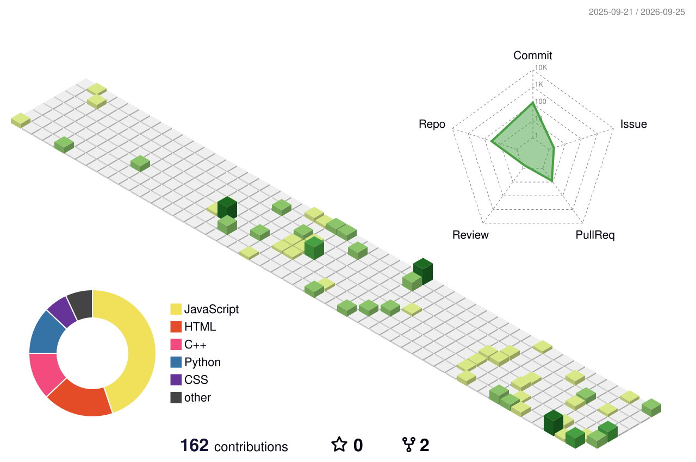

<div align="center">


<h1>Hi, I'm Sanskriti Shrivastava   &nbsp;</h1>


</div>

<br>

<!-- ====================== ABOUT ====================== -->
<table width="100%">
<tr>
<td width="55%" valign="middle">

```text
$ whoami
> person who writes code

$ what_i_do
> make websites do things

$ current_problem
> AI

$ current_focus
> RAG • LangChain • GenAI

$ skill_level
> depends on whether the code is working

$ philosophy
> if it works, don't touch it

$ debugging
> add print statement
> pray

$ status
> it worked yesterday
```

</td>
<td width="45%" align="center">

</td>
</tr>
</table>

<br>

<!-- ====================== MARIO DESK ====================== -->
<div align="center">

</div>

<br>

<!-- ====================== TECH STACK ====================== -->
### 🛠️ Tech Stack

<div align="center">


</div>

<br>

<!-- ====================== MOVING LOGOS STRIP ====================== -->
<div align="center">


</div>

<br>

<!-- ====================== 3D CONTRIBUTION GRAPH ====================== -->

<picture>
  <source media="(prefers-color-scheme: dark)" srcset="profile-3d-contrib/profile-night-rainbow.svg">
  <source media="(prefers-color-scheme: light)" srcset="profile-3d-contrib/profile-green-animate.svg">
  
</picture>


<br>


<!-- ====================== CONNECT ====================== -->
<div align="center">

### 📫 Let's Connect

[](https://www.linkedin.com/in/sanskriti-shrivastava-412aa4381/)
[](https://leetcode.com/u/SANSKRITISHRIVASTAVA17/)
[](mailto:sanskritishrivastava619@gmail.com)

<br><br>


</div>
<!-- ====================== PARTY PARROTS ====================== --> <div align="center">

&nbsp;&nbsp;&nbsp;&nbsp;&nbsp;&nbsp;&nbsp;&nbsp;&nbsp;&nbsp;&nbsp;&nbsp;&nbsp;&nbsp;&nbsp;&nbsp;&nbsp;&nbsp;&nbsp;&nbsp;&nbsp;&nbsp;&nbsp;&nbsp;&nbsp;&nbsp;&nbsp;&nbsp;&nbsp;&nbsp;&nbsp;&nbsp;&nbsp;&nbsp;&nbsp;&nbsp;&nbsp;&nbsp;&nbsp;&nbsp;&nbsp;&nbsp;&nbsp;&nbsp;&nbsp;&nbsp;&nbsp;&nbsp;&nbsp;&nbsp;&nbsp;&nbsp;&nbsp;&nbsp;&nbsp;&nbsp;&nbsp;&nbsp;&nbsp;&nbsp;&nbsp;&nbsp;&nbsp;&nbsp;&nbsp;&nbsp;&nbsp;&nbsp;&nbsp;&nbsp;&nbsp;&nbsp;&nbsp;&nbsp;&nbsp;&nbsp;&nbsp;&nbsp;&nbsp;&nbsp;&nbsp;&nbsp;&nbsp;&nbsp;&nbsp;&nbsp;&nbsp;&nbsp;

</div>
